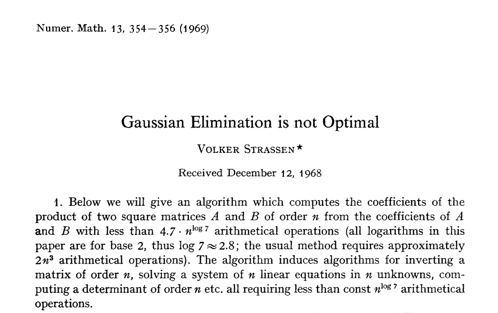

# Gaussian Elimination is not Optimal--Strassen's Algorithm and its Drawbacks in C
Strassen’s algorithm introduced in the 1969 (presented in 1968) paper, _Gaussian Elimination is not Optimal_ (Strassen, 1969) was the world’s first subcubic matrix multiplication algorithm.

We code Strassen’s matrix multiplication algorithm in C from the original 1969 paper and observe why compiler engineers rarely use the algorithm in practice on [LeetArxiv](https://leetarxiv.substack.com/p/why-compilers-rarely-use-strassens-algorithm)




We code the paper in C and test different cases.

Getting Started
```
clear && gcc Strassen_Naive.c -lm -o m.o && ./m.o
```
